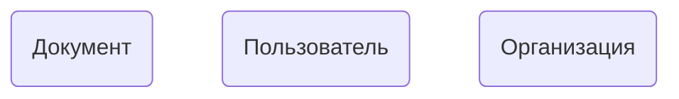

# Документооборот

### Основной стек технологий:
- Java 17
	> Records, Switch expression, String Block
	
- Docker
	> Docker compose file
	
- Maven

- Spring boot
	> кэширование (spring cache, hazlecast)

- Postgresql
- hibernate (cache)
- kafka
- Swagger
- codestyle
- mockito, junit

Дополнительно:
- jwt
- streamEx
- мониторинг prometheus и grafana
- логгирование graylog

### Сущности

